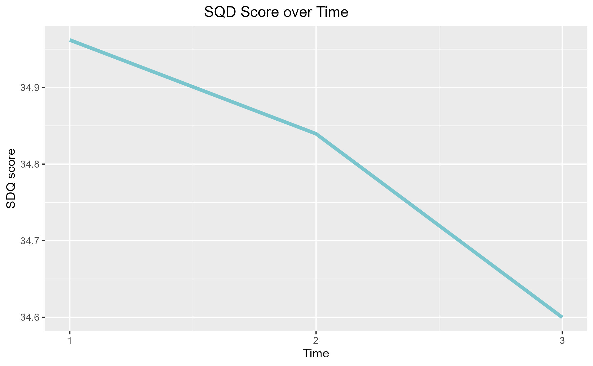

```{=html}
<!---
title: "our_front_cover"
author: "chrysie"
date: "2024-05-16"
output:
  html_document:
    theme: cerulean  # Choose a Bootstrap theme
    highlight: tango  # Choose a syntax highlighting style
    toc: true        # Table of contents
    toc_float: true  # Floating table of contents
    keep_md: false   # Hide the YAML header in the rendered HTML output
--->
```
Chrysie, Tat and Zoe's LDAP Project


<<<<<<< HEAD
# Background

Our longitudinal project was based on Rice et al., 2017 <https://doi.org/10.5255/UKDA-SN-852714>

# research question

To investigate the role of our IVs on psychological adjustment from primary to secondary school IVs: personal characteristics, attitudes to school, relationships & academic attainment

Here is a figure showing the change in SDQ score over time
=======
>>>>>>> 818b56a5a5e4c700e445d8eb48f34c1be859afa7
