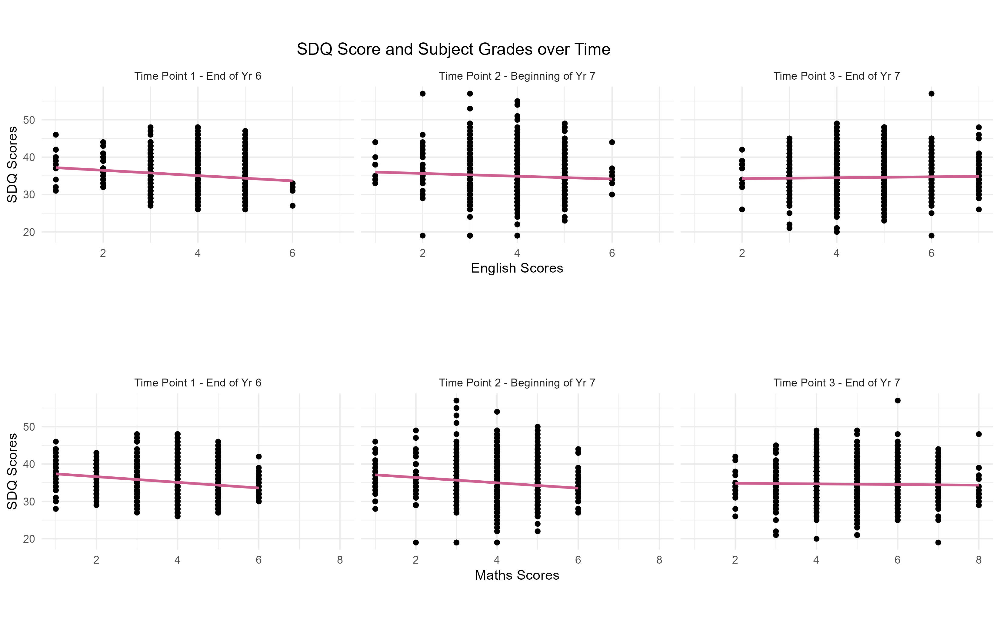

```{=html}
<!---
title: "our_front_cover"
author: "chrysie"
date: "2024-05-16"
output:
  html_document:
    theme: cerulean  # Choose a Bootstrap theme
    highlight: tango  # Choose a syntax highlighting style
    toc: true        # Table of contents
    toc_float: true  # Floating table of contents
    keep_md: false   # Hide the YAML header in the rendered HTML output
--->
```
Chrysie, Tat and Zoe's LDAP Project


# Background

Our longitudinal project was based on Rice et al., 2017 <https://doi.org/10.5255/UKDA-SN-852714>

This was titled: A longitudinal multi-informant study of psychological adjustment and academic attainment over the transition from primary school to secondary school

# Our research question

To investigate the role of our IVs on psychological adjustment in children from primary to secondary school

IVs: personal characteristics, attitudes to school, relationships & academic attainment

Psychological adjustment: SDQ (Strengths & Difficulties Questionnaire) Personal characteristics: Wentzel's Attitudes to school: SCQ (School Concerns Questionnaire), CDPQ (Child Development Project Questionnaire: trust and respect for teachers) Social factors: LICS (School-oriented version of the Loneliness in Children scale) Academic attainment: KS2/3 results

We looked at this over 3 waves - end of year 6, start of year 7 and end of year 7

# Descriptive data

We had a look at some demographic data out of interest.

Here are the childrens' grades over time

The ethnicity of the children

Their gender

And finally, the languages most commonly spoken as the first language

# Cleaning and processing our data

First, we had to clean and process our data. For example, here is our code where we separating the SDQ into the 3 waves and summing up the rows of data:

```{r Cleaning SDQ data}
cols_C1B \<- new_data[, c("C1_B1", "C1_B2", "C1_B5", "C1_B10", "C1_B11", "C1_B12", "C1_B13", "C1_B14", "C1_B15", "C1_B16", "C1_B17", "C1_B18", "C1_B19", "C1_B20", "C1_B21", "C1_B22", "C1_B23", "C1_B24", "C1_B25")]

cols_C2B \<- new_data[, c("C2_B1", "C2_B2", "C2_B5", "C2_B10", "C2_B11", "C2_B12", "C2_B13", "C2_B14", "C2_B15", "C2_B16", "C2_B17", "C2_B18", "C2_B19", "C2_B20", "C2_B21", "C2_B22", "C2_B23", "C2_B24", "C2_B25")]

cols_C3B \<- new_data[, c("C3_B1", "C3_B2", "C3_B5", "C3_B10", "C3_B11", "C3_B12", "C3_B13", "C3_B14", "C3_B15", "C3_B16", "C3_B17", "C3_B18", "C3_B19", "C3_B20", "C3_B21", "C3_B22", "C3_B23", "C3_B24", "C3_B25")]

C1_Btotal \<- rowSums(cols_C1B) 
C2_Btotal \<- rowSums(cols_C2B) 
C3_Btotal \<- rowSums(cols_C3B)
```

Once we had organised all our data like this, we created a tibble & converted into long format.

```{r Converting to Long Format}
long_data \<- sum_data %\>%
pivot_longer(
  cols = matches("C[123]"),
  names_to = c("timepoint", "measure"),
  names_pattern = "C(\\d+)(.\*)" ) %\>%
pivot_wider(names_from = measure, values_from = value ) %\>%
rename(Time = timepoint) %\>%
mutate(Time = factor(Time, levels = c("1", "2", "3"))) %\>%
arrange(ID, Time) %\>%
relocate(Time, .after = ID) %\>%
mutate(Time = as.numeric(Time)) %\>%
mutate_at(vars(ends_with("total")), \~replace_na(., 0)) %\>%
mutate_at(vars(FSM, Eng, Mat), \~replace_na(.,0))
source(analysis.Rmd)
```

# Our results: LME models

Next, we looked at linear mixed effects models - this is a model with random intercept. Here we found that mental well-being decreases slightly over time, and this effect is statistically significant. We also found significant variability in the intercepts across different children, suggesting that individual differences account for a substantial portion of the variance in mental well-being over this period of time:

```{r}
base_model <- lmerTest::lmer(Btotal ~ Time + (1 | ID), data = long_data)
summary(base_model)
```

Then, we created a model considering the effect of FSMs on SDQ over time, where we found that children on free school meals transitioned worse in regard to their mental health:

```{r}
fixed_model <- lmerTest::lmer(Btotal ~ Time + FSM + (1 | ID), data = long_data)
summary(fixed_model)
```

Here is a figure showing effect of free school meals on SDQ score over time

Next, we looked at the crossover between grades and SDQ scores. Interestingly, higher maths and English scores linked with lower SDQ scores - however, the interaction with time showed that the relationship between maths and SDQ does not change significantly over time.

```{r}
grades_model <- lmerTest::lmer(Btotal ~ Time * Eng + Time * Mat + (1 | ID), data = long_data)
summary(grades_model)
```

Here's the figure:

Finally, we considered the effect of all the above factors on SDQ over time.

```{r}
full_model <- lmerTest::lmer(Btotal ~ Time * AGtotal + Time * SCtotal + Time * LTtotal + Time * Ltotal + FSM + (1 | ID), data = long_data)
summary(full_model)
```

Here is a figure showing the change in SDQ score over time

We then compared the two models to see which is a better, stronger model for our data, finding that the full model is, as expected, a better fit:

```{r}
anova(full_model, base_model)
```

# Our results: SEM models

Next, we created an SEM model. The SEM model tested relationships among variables over time, focusing on how initial conditions and changes in variables influence subsequent outcomes.

```{r}
library(lavaan)

reg_model <- '
  # Regressions at each time point
  C1_Btotal ~ C1_AGtotal + C1_SCtotal + C1_LTtotal + C1_Ltotal + FSM + C1_Eng + C1_Mat
  C2_Btotal ~ C2_AGtotal + C2_SCtotal + C2_LTtotal + C2_Ltotal + FSM
  C3_Btotal ~ C3_AGtotal + C3_SCtotal + C3_LTtotal + C3_Ltotal + FSM + C3_Eng + C3_Mat
'

reg_fit <- sem(reg_model, data = norm_data, missing = "fiml", fixed.x = FALSE)
summary(reg_fit, fit.measures = TRUE)
```

Here's our plots: 1:

2:

Overall, the SEM analysis provided insights into how various factors such as academic scores (Eng, Mat), socio-emotional factors (AGtotal, SCtotal, LTtotal, Ltotal), and demographic characteristics (FSM) relate to each other and influence SQD scores across different time points. The model showed a good fit to the data, suggesting that the specified relationships adequately explain the observed data patterns.

# Our results: Cross-lagged model

Finally, here is our cross-lagged model, to understand how the variables load onto each other at each time point:

```{r}
crosslagged_model <- '
  # Regressions at each time point
  C1_Btotal ~ C1_AGtotal + C1_SCtotal + C1_LTtotal + C1_Ltotal + FSM 
  C2_Btotal ~ C2_AGtotal + C2_SCtotal + C2_LTtotal + C2_Ltotal + FSM
  C3_Btotal ~ C3_AGtotal + C3_SCtotal + C3_LTtotal + C3_Ltotal + FSM

  # Auto-regressive paths
  C2_Btotal ~ C1_Btotal
  C3_Btotal ~ C2_Btotal
  
  # Cross-lagged paths (to see the influence of predictors over time)
  C2_AGtotal ~ C1_AGtotal
  C3_AGtotal ~ C2_AGtotal
  C2_SCtotal ~ C1_SCtotal
  C3_SCtotal ~ C2_SCtotal
  C2_LTtotal ~ C1_LTtotal
  C3_LTtotal ~ C2_LTtotal
  C2_Ltotal ~ C1_Ltotal
  C3_Ltotal ~ C2_Ltotal
'
cl_fit <- sem(crosslagged_model, data = norm_data, missing = "fiml", fixed.x = FALSE)
summary(cl_fit, fit.measures = TRUE)
```
Overall, our cross-lagged model shows:
1. Significant coefficients of C1_AGtotal, C1_SCtotal, C1_LTtotal, C1_Ltotal, and FSM indicate these variables predict C1_Btotal scores. 2. Autoregressive paths (C2_Btotal \~ C1_Btotal, C3_Btotal \~ C2_Btotal) indicate stability in scores over time. 3. Cross-lagged paths (C2_AGtotal \~ C1_AGtotal, C3_AGtotal \~ C2_AGtotal, and similar for other variables) assess how earlier scores of one variable predict subsequent scores of another, indicating directional influences over time. 4. Significant Paths: Variables like SCtotal, LTtotal, and Ltotal show significant relationships with SDQ scores across time points, suggesting these factors influence academic outcomes. 5. Free School Meal status shows varying influence across time points on academic and psychosocial outcomes.

Conclusion: The analysis provides insights into how socio-demographic factors (such as FSM), psychological variables (AGtotal, SCtotal, LTtotal, Ltotal), and academic outcomes (Btotal) interplay over three time points. The model fits the data adequately, though some relationships could be further explored or refined based on future research or model modifications.

# Conclusions
Overall, we looked at psychological adjustment in children from primary to secondary school and how it is influenced by a variety of factors. We found that:
1. Over time, from year 6 to year 7, psychological adjustment worsens
2. For children with free school meals, psychological adjustment is more difficult
3. For children with higher grades, psychological adjustment is more difficult
4. Emotional factors such as school concern, teacher liking and loneliness all affect psychological adjustment

# Impacts
The impacts of these findings can support:
1. Parental and teacher education, to be aware of these risk factors
2. Early intervention, providing deeper support for children on FSM, especially with high grades
3. Greater understanding of the impacts of socioeconomic difficulties and academic pressure on children

# Limitations
1. Qualitative data from the children could have helped to contextualise these findings
2. Cohort effect of schools may impact our results
3. Missing data!!